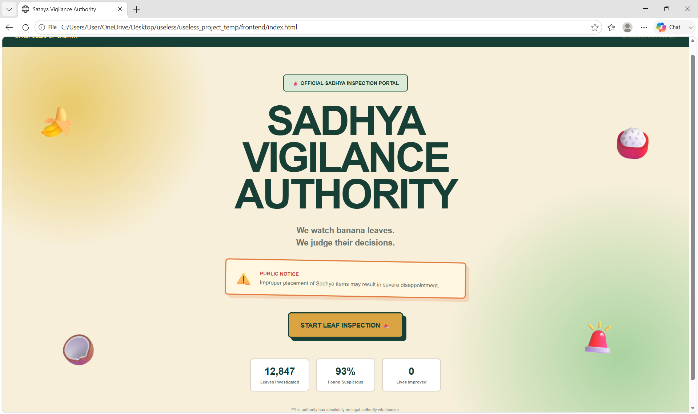
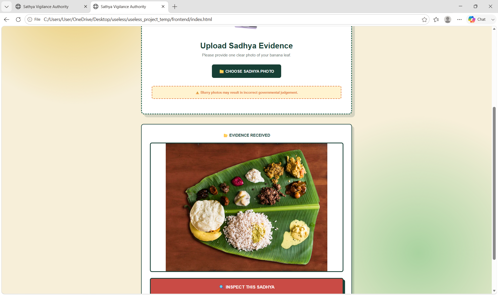
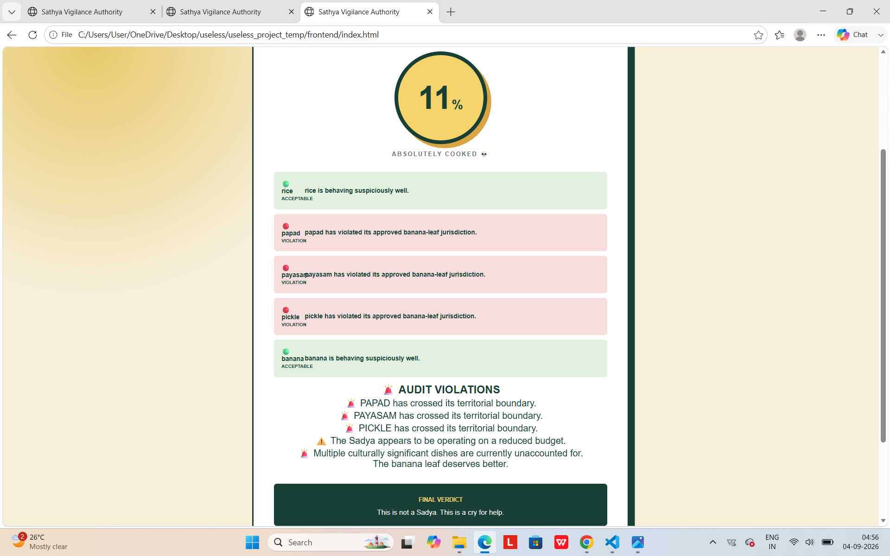

# [SADHYA VIGILANCE COMMITTEE] 🎯

## Basic Details
### Team Name: [404 STACK]

### Team Members
- Team Lead: [ARYA NEERAJ] - [MEC THRIKKAKARA]
- Member 2: [DIYA JINS] - [MEC THRIKKAKARA]

### Project Description
[Sadhya Vigilance Committee is a hilariously judgmental AI tool that takes a photo of your banana leaf feast, points out every single misplaced dish, and ruthlessly scores your Sadhya setup]

### The Problem (that doesn't exist)
[Humanity has survived thousands of years eating 20-item leaf feasts just fine, making it a critical emergency that nobody is grading your plating accuracy out of 100. Food is currently being digested without an AI model screaming at you because your Upperi is three centimeters off from the sacred leaf tip.]

### The Solution (that nobody asked for)
[Instead of just eating your lunch while it’s hot, you now have to whip out your phone, snap a picture, and wait anxiously while an AI inspects your banana leaf to see if you've disgraced your ancestors. It aggressively grades your plating, flags imaginary coordinate crimes, and ensures your Upperi never gets eaten without software officially giving you a disappointing score.]

## Technical Details
### Technologies/Components Used
For Software:
- [PYTHON,JAVASCRIPT,HTML,CSS]
- [Flask: Backend web framework; creates the /audit API and handles image uploads
    Flask-CORS: Allows the frontend running on another laptop/origin to communicate with the Flask backend]
- [Flask, Flask-CORS, Ultralytics, PyTorch,  OpenCV]
- [VS CODE,GIT,ENDLESS CUP OF COFFEE]

For Hardware:
- [List main components]
- [List specifications]
- [List tools required]

### Implementation
For Software:
# Installation
[
1. Clone the repository
    git clone <repository-url>
    cd useless_project_temp
2. Create a virtual environment
    python -m venv venv

    Activate it:

    Windows:

    venv\Scripts\activate
3. Install dependencies
    pip install -r requirements.txt]

# Run
[1. Run the backend

From the project root:

    python -m backend.app

    The Flask server will start on port 5000.

2. Run the frontend

    Open:

    frontend/index.html]

### Project Documentation
For Software:

# Screenshots (Add at least 3)
]The landing page of Sadhya Auditor where the user can start the inspection.

]The user uploads a Sadya image and previews it before inspection.

]The AI-generated Sadya score, detected dishes, violations, roast, and final verdict.

# Diagrams
![USER
               │
               ▼
       ┌───────────────┐
       │   FRONTEND    │
       │ HTML/CSS/JS   │
       └───────┬───────┘
               │
         Upload Image
               │
               ▼
       ┌───────────────┐
       │ FLASK BACKEND │
       │   /audit API  │
       └───────┬───────┘
               │
               ▼
       ┌───────────────┐
       │    YOLOE      │
       │ Dish Detection│
       └───────┬───────┘
               │
               ▼
       ┌───────────────┐
       │ SADYA AUDITOR │
       │ Position Check│
       └───────┬───────┘
               │
               ▼
       ┌───────────────┐
       │ Score + Roast │
       │ + Violations  │
       └───────┬───────┘
               │
               ▼
       ┌───────────────┐
       │ RESULT PAGE   │
       └───────────────┘](Add your workflow/architecture diagram here)
*Add caption explaining your workflow*

For Hardware:

# Schematic & Circuit

*Add caption explaining connections*

*Add caption explaining the schematic*

# Build Photos

*List out all components shown*

*Explain the build steps*

*Explain the final build*

### Project Demo
# Video
[<video controls src="WhatsApp Video 2026-09-04 at 05.53.46.mp4" title="Title"></video>]
The demo video showcases the complete Sadhya Auditor workflow, from uploading a Sadya image to receiving the AI-generated score, detected dishes, violations, roast, and final verdict.

# Additional Demos
[github link https://github.com/Diya139/useless_project_temp]

## Team Contributions
- [Diya Jins]: [Frontend development, UI design, image upload/preview functionality, result display, and frontend-backend integration.]
- [Arya Neeraj]: [Backend development, YOLOE-based dish detection, Sadya auditing logic, Flask API, and backend integration.]

---
Made with ❤️ at TinkerHub Useless Projects 

